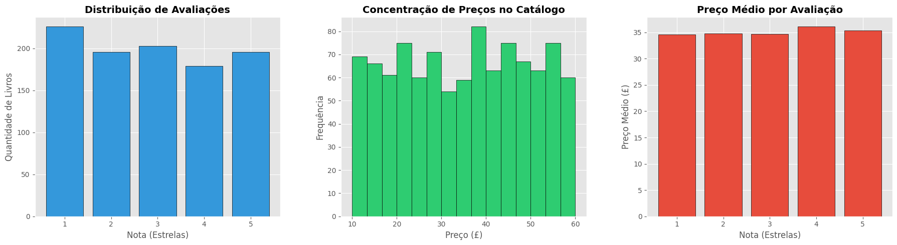

# Data Analysis Project: E-commerce Book Catalog

[](https://www.python.org/)
[](https://pandas.pydata.org/)
[](https://matplotlib.org/)

## Sobre o Projeto
Este repositório contém um projeto completo de **Análise Exploratória de Dados (EDA)**. O objetivo foi extrair dados brutos de um catálogo de livros via Web Scraping, realizar um tratamento rigoroso (Data Cleaning) e gerar visualizações que apoiem a tomada de decisão estratégica em um cenário de e-commerce.

O projeto foi desenvolvido para consolidar os conhecimentos da certificação **IBM Python for Data Science** e aplicar conceitos de eficiência algorítmica.

## Tecnologias e Ferramentas
- **Linguagem:** Python 3.x
- **Extração:** `Requests` e `BeautifulSoup4`
- **Manipulação e Limpeza:** `Pandas` e `NumPy`
- **Visualização:** `Matplotlib`

## Estrutura do Repositório
- `requisicao.py`: Script de backend responsável pela extração automatizada dos dados (Web Scraping).
- `data/`: Pasta contendo o dataset bruto em formato CSV (`Books_catalog`).
- `notebooks/`: Contém o `project.ipynb` com todo o pipeline de limpeza e análise.
- `requirements.txt`: Lista de dependências para reprodução do ambiente.

## Processamento de Dados (ETL)
Durante a fase de limpeza no Pandas, foram aplicadas as seguintes técnicas:
- **Regex (Expressões Regulares):** Extração de números de volume e limpeza de ruídos nos títulos.
- **Data Type Casting:** Conversão de preços (removendo símbolos monetários) e ratings (mapeando strings como 'Three' para inteiros 3).
- **Tratamento de Nulos:** Validação de integridade para garantir que cada entrada tenha dados consistentes para análise.

## Insights Extraídos
O dashboard final gerado no projeto foca em três pilares:
1. **Distribuição de Avaliações:** Frequência de notas de 1 a 5 estrelas.
2. **Faixas de Preço:** Identificação da concentração de preços no catálogo.
3. **Relação Preço vs. Qualidade:** Análise se livros com maior ticket médio possuem melhores avaliações.

## Como Executar
1. Instale as dependências:
   ```bash
   pip install -r requirements.txt

2. Execute o script de extração (opcional):
    ```bash
    python requisicao.py

3. Explore as análises no arquivo notebooks/project.ipynb.




Gabriel Simonaci [LinkedIn](https://www.linkedin.com/in/gabriel-simonaci-volpini/) | [GitHub](https://github.com/sim0naci)


